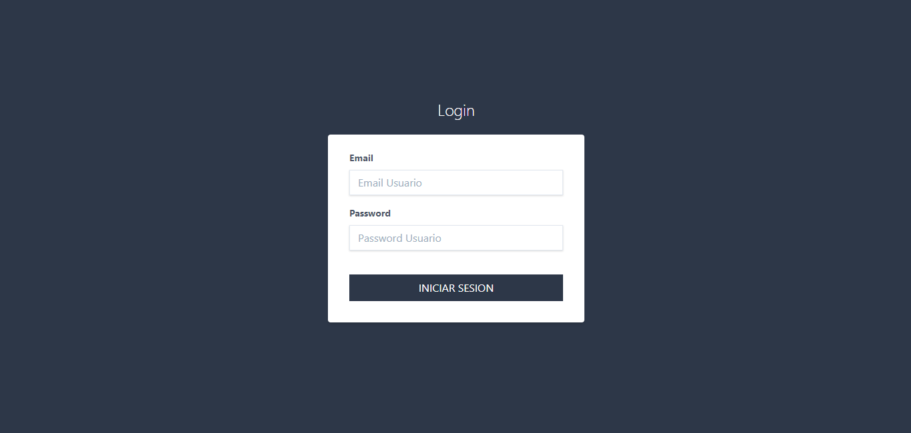
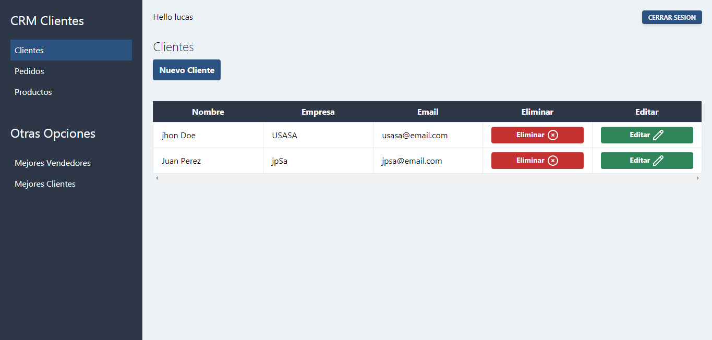
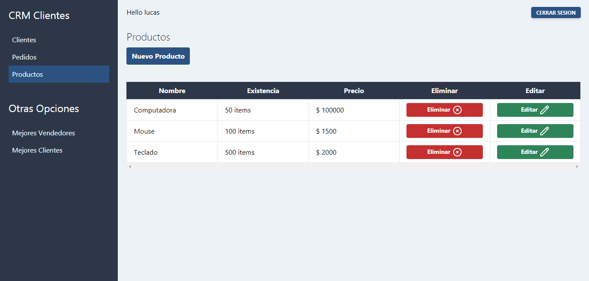
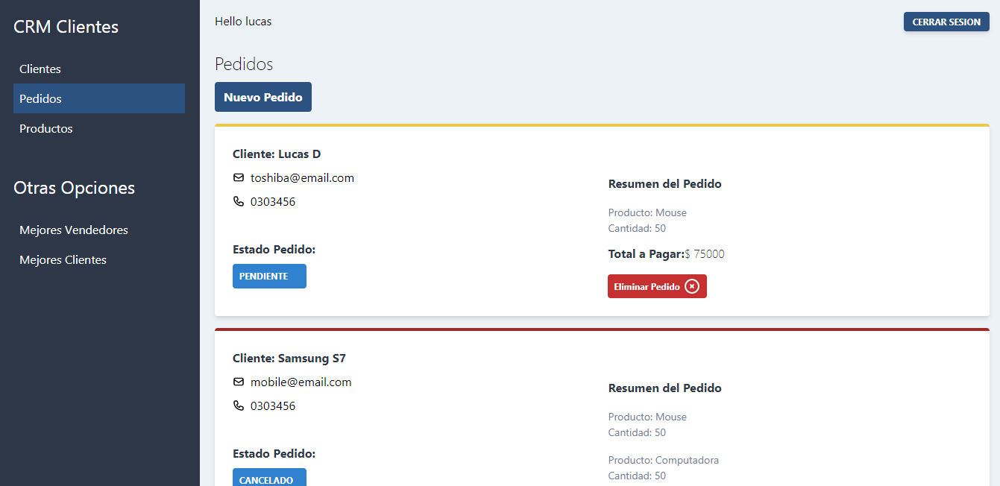
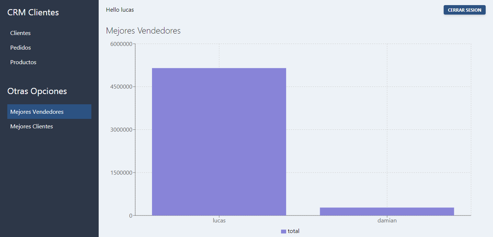
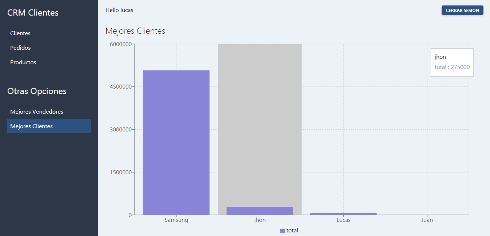

# CRM Project: 
### ReactJS, Next, TailWind, ApolloCliente

Through the app you can administrate Clients, Sales Orders and Products of a regular store. You can also see who were the Clients who pay more money for their purchases and the Employee who sold the best.
You can find the Back in https://github.com/gomezlucas/CRMGraphQL

To Test: 
User: lucas@email.com
password: 123456

#### Screens:

### Login 
 

### Clientes 
 

### Productos 
 

### Pedidos 
 

### Mejores Vendedores 
 

### Mejores Clientes 
 